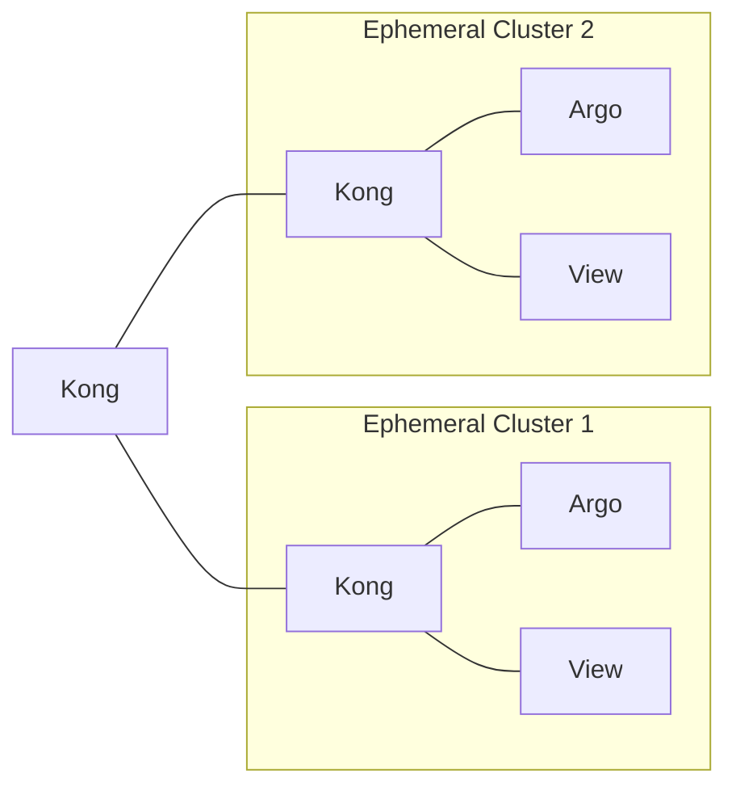

# Ephemeral Kubernetes: kind + vcluster + Headlamp

Spin up a local **kind** host, an isolated **vcluster**, and the **Headlamp** dashboard with a ready-to-use token and port-forward. Built for fast demos and repeatable dev environments.

## How to deploy

- `just all` — creates kind `$HOST`, deploys vcluster `$VNAME`, generates kubeconfig, installs Headlamp, port-forwards to `http://localhost:$VPORT`, saves token at `vcluster/$VNAME/.dashboard.token.txt`.
- `just cluster-create` — creates only the kind cluster `$HOST`.

## How to stop

- `just cluster-delete` — deletes the kind cluster `$HOST` and cleans `./vcluster`.
